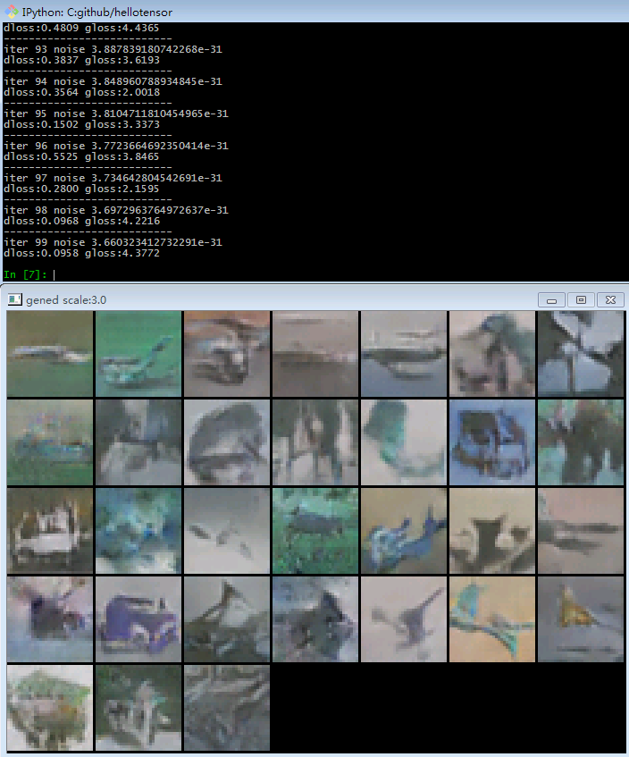

! Fast DCGAN in Keras

# Fast DCGAN in Keras

DCGAN have been implemented in a lot of frameworks. However, existing Keras and Tensorflow implementations are SLOW due to duplicated computation.

Here's the GAN concept:

<dot
digraph{
  "some_vector z" -> G -> "generated(fake) image"
  "input(real) image" -> D -> "p(input), 1 for real, 0 for fake"
}
/>

And here's the optimal GAN training architecture:

<dot
digraph{
  rankdir=TB;

  Wg -> G
  z -> G -> generated_images -> "D(copy1)" -> G_loss

  { rank=same; G Wg }
  G_loss -> Wg[color=green,constraint=false]

  Wd -> "D(copy2)"
  input_images -> "D(copy2)" -> D_loss

  { rank=same; G_loss D_loss }

  D_loss -> Wd[color=blue,constraint=false]

  "D(copy1)" -> D_loss[constraint=false]
  Wd -> "D(copy1)"[constraint=false]
}
/>

Basically we want to do two things in one forward-backward pass:

1. update Wd w.r.t. D_loss
2. update Wg w.r.t. G_loss

This kind of update(different parameters w.r.t. different loss) however is not possible in Keras.

> but possible in Torch - check soumith/dcgan.

So the dumb solution was to create two model, one updates Wd after its forward-backward pass, another updates Wg after its forward-backward pass.

<dot
digraph{
  z -> "G(copy1)" -> generated_images -> "D(copy1)" -> D_loss
  input_images -> "D(copy2)" -> D_loss
  Wd -> "D(copy1)"
  Wd -> "D(copy2)"

  D_loss -> Wd[color=blue,constraint=false]
  G_loss -> Wg[color=green,constraint=false]

  { rank=same; "G(copy2)" Wg }

  "z(again)" ->"G(copy2)"
  Wg -> "G(copy2)" -> "generated_images(again)" -> "D(copy3)" -> G_loss
}
/>

That worked, but unfriendly to our precious computational resources.

To apply two different parameter updates in one forward-backward pass, you will need to write your own update code in raw Tensorflow. Here's how:

1. Create D and G network in Keras, as usual;

2. Write your parameter update operations by hand:

    ```py
    # noise: the input z
    # real_image input
    noise = Input(shape=g.input_shape[1:])
    real_image = Input(shape=d.input_shape[1:])

    # dm and gm are your generative and discriminative network.
    generated = gm(noise)

    # dm should produce a score between (0,1) remember?
    gscore = dm(generated)
    rscore = dm(real_image)

    def log_eps(i):
        return K.log(i+1e-11)

    # calculate the losses

    # single side label smoothing: replace 1.0 with 0.9 for real input
    dloss = - K.mean(log_eps(1-gscore) + .1 * log_eps(1-rscore) + .9 * log_eps(rscore))
    gloss = - K.mean(log_eps(gscore))

    Adam = tf.train.AdamOptimizer

    lr,b1 = 1e-4,.2 # otherwise won't converge.
    optimizer = Adam(lr,beta1=b1)

    # update Wd w.r.t. D_loss
    grad_loss_wd = optimizer.compute_gradients(dloss, dm.trainable_weights)
    update_wd = optimizer.apply_gradients(grad_loss_wd)

    # update Wg w.r.t G_loss
    grad_loss_wg = optimizer.compute_gradients(gloss, gm.trainable_weights)
    update_wg = optimizer.apply_gradients(grad_loss_wg)

    ```

3. instead of using `model.fit()`, run the parameter update by hand:

    ```py
    train_step = [update_wd, update_wg, other_parameter_updates]
    sess.run(train_step,feed_dict={noise,real_image.......})
    ```

The full code is available at <https://github.com/ctmakro/hellotensor/blob/master/lets_gan_clean.py>.

Here's the code running on a GTX 1060:


