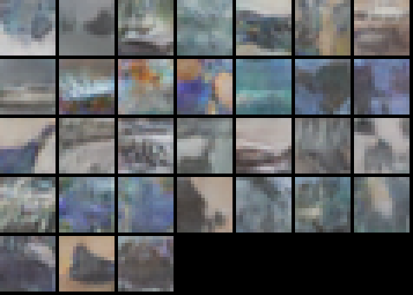
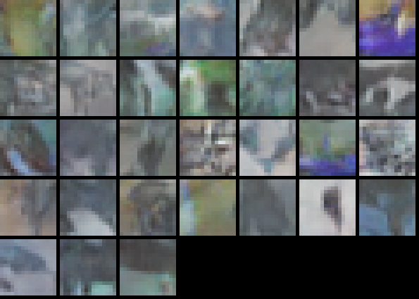
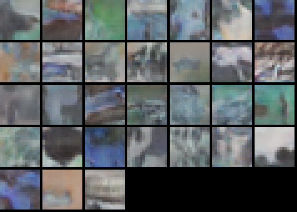

!GAN 生成式对抗网络

# Generative Adversarial Network 生成式对抗网络

>更新：我用Keras加一点点Tensorflow实现了一个非常快的GAN，详见 <fast_gan_in_keras.html>

常见的神经网络可以分为“生成式模型”和“区分式模型”。区分式模型(discriminative model)尝试在输入特征之间建立近似的and或者or的关系，以实现对输入进行分类的目的。

比如我们用猫和老虎的脸部图片，训练一个神经网络对物种进行分类，网络通常会这么做：

<dot
digraph {
	tiger_face -> "stripe detector";
	cat_face -> "stripe detector";
  "stripe detector" -> "tiger if stripe > 1, cat if stripe < 1";
}
/>

也就是通过条纹的强度，来区分猫和老虎。

如果我们有意增加一些带有条纹的猫的图片，对网络进行训练，为了更明确地区分猫和老虎，网络可能会这么做：

<dot
digraph {
  tiger_face -> "stripe detector";
  stripy_cat_face -> "stripe detector";
	cat_face -> "stripe detector";

  tiger_face -> "eye detector";
  stripy_cat_face -> "eye detector";
  cat_face -> "eye detector";

  "eye detector" -> "dangerous if stripe around eye, safe if not"
  "stripe detector" -> "dangerous if stripe around eye, safe if not"

  "dangerous if stripe around eye, safe if not" -> "tiger if dangerous, cat otherwise";
}
/>

我们发现，区分式模型具有“特征惰性(feature laziness)”，也就是神经网络跟人一样善于偷懒，倾向于用最明显、最简单的特征完成分类任务。假如我们现在用这个神经网络对猫和老虎的躯干图片进行分类，准确率会非常低。

为了提高区分式模型的性能，常见的做法就是准备成千上万张不同角度、不同品种的猫和老虎的图片，对网络进行训练。通常会得到这样的结果：

<dot
digraph {
  input -> stripe
  input -> eye
  input -> stripe_color
  input -> fur
  input -> surrounding
  input -> sharp_teeth

  stripe -> dangerous
  eye -> dangerous
  fur -> dangerous
  stripe_color -> dangerous
  sharp_teeth -> dangerous

  eye -> cute
  fur -> cute
  stripe_color -> cute

  surrounding -> rural
  surrounding -> homestay

  dangerous -> output
  cute -> output
  rural -> output
  homestay -> output
}
/>

通过增加训练数据的量，模型能从数据中学习到更多用于区分物种的特征。

问题是，模型仍然只学到了猫和老虎的各种区别，而无法学习猫和老虎共有的特征（比如都有尾巴，腿都长在躯干下面）。

如果这时我们将这个网络用作识别狮子和豹，准确率会很低，于是又要再准备大量的训练数据。相比之下，人类只需要几张狮子和豹的图片就足够了。这种对人工标记训练数据的无限制的需求，是区分式模型的噩梦。

## Data Shortage

正是由于“特征惰性”，很多做机器学习的“数据科学家”们经常会跟其他部门的同事发生如下对话：

- 请问你们能不能做xyz……
- 数据在哪里？没数据免谈

- 谷歌出了个新的abc功能……
- 那是因为他们积累了足够的用户数据，怎么弄都行

- 项目怎么还没做完……
- 经费不够，不然就请人标注了

## Unsupervised Learning came to be rescued

自然界中带有明确分类标签的数据是非常稀少的，特别是这些标签只对人类有意义，因此只能由人类来进行标示，产生了很大的工作量。然而人类在了解世界的过程中，并不需要将一切所见所闻都打上标签，那么人类是怎样实现高效学习的呢？

神经科学理论认为，人类学习源自对周围环境的预测。如果身边的一切事物跟预想的一样规律运作，学习就不会发生；如果所预测的运作与观测不符，学习就会发生。这种能力能够帮助我们逐渐适应并利用环境。

回到对猫、老虎、狮子、豹进行分类的例子上来。人类通过大量观察各种不同的动物（河马、大象、狗、驴等等），可以在大脑中建立这样的神经网络：

<dot
digraph{
  input -> leg_width
  input -> stripe
  input -> height
  input -> body_position
  input -> leg_position
  input -> tail_position

  body_position -> is_animal
  leg_position -> is_animal
  tail_position -> is_animal

  body_position -> not_animal
  leg_position -> not_animal
  tail_position -> not_animal

  is_animal -> dog
  stripe -> dog
  height -> dog

  is_animal -> elephant
  leg_width -> elephant
  tail_position -> elephant
  height -> elephant

  is_animal -> hippo
  leg_width -> hippo

  tail_position -> mule
  is_animal -> mule
  height -> mule
}
/>

即便这些训练数据都不带标签，人类也能从中学到一些关于动物的知识，比如动物都是一个躯干旁边四条腿，如果在躯干四周看不到腿，或者看不到尾巴，很可能就不是动物(图中的not_animal)。

在掌握“腿”和“躯干”之间的互相依赖关系这样的抽象特征之后，再去对猫、老虎、狮子、豹进行分类，人类就能够将这些概念与图中的具体动物进行匹配，从而减少需要学习的特征数量，降低学习难度。例如，我们看到图片中的毛发，就可以根据毛发位于躯干四周的具体位置，来决定毛发究竟是属于躯干，还是属于腿部、尾部、耳朵，而不需要再从数据中专门学习“腿部毛发”、“尾部毛发”这样的概念。

<dot
digraph{
  input -> fur
  input -> body_position
  input -> leg_position
  input -> tail_position

  body_position -> body_fur
  leg_position -> leg_fur

  fur -> body_fur
  fur -> leg_fur

  body_fur -> output
  leg_fur -> output
}
/>

结果就是，对于新的分类任务，只需要使用很少的带标签数据，就能训练出非常高效的分类器。历史上有一位长者常说他“见的多了”，“哪个国家没去过”，不管是跟找茬的美国记者还是跟赛跑的香港记者一样能“谈笑风生”，其实是一样的原理。

在ML领域，这类对不带标签的数据进行学习并掌握概括性特征的方法，被归类为Unsupervised Learning（非监督式学习）。由于这方面商业兴趣不大，所以应用一直滞后于Supervised Learning(监督式学习，或带标签学习)。

## GAN

可以这么说：监督式学习是用神经网络拟合 p(标签|数据)，而非监督式学习是用神经网络拟合 p(数据)，即从数据中寻找具有代表性、概括性的特征（或者说，适应数据特征之间的条件概率分布）。

在没有标签的情况下，我们无法通过标签提供的误差梯度对网络进行训练，必须要通过其他方法定义误差函数以产生误差梯度。

这方面的先驱是Hinton提出的Restricted Boltzmann Machine；其他方法还包括 Variational Auto Encoder等等。在此略过不做介绍。

真正让人眼前一亮的，是最近搞起的Generative Adversarial Network，即GAN。

GAN方法需要两个神经网络，一个生成网络G和一个区分网络D。

<dot
digraph{
  "some_vector z" -> G -> "generated(fake) image"
  "input(real) image" -> D -> "p(input), 1 for real, 0 for fake"
}
/>

生成网络G的输入是一个矢量，输出一张图片；
区分网络D的输入是一张图片，输出一个(0,1)之间的概率。

区分网络D的任务是辨别输入的真伪。如果输入图片来自训练样本(x)，则应该输出接近1的概率：如果输入图片来自生成网络G，则应该输出接近0的概率。

> 即： D(G(z)) -> 0， D(x) -> 1

首先训练D:

> maximize log(D(x)) + log(1-D(G(随机矢量)))

这会提高D对训练样本和生成样本的区分能力。

然后训练G:

> maximize log(D(G(随机矢量)))

这会提高G生成样本对D的欺骗能力。

如此循环下去，G会生成在特征上越来越接近训练样本的图片；而D会对训练样本和生成样本之间的差异（也就是训练样本不同特征之间的相互依赖关系）越来越敏感。于是很多人将GAN中的G用作图像生成、图像修补、图像超采样等领域，获得了非常好的效果。

我根据DCGAN的Torch源码，利用Keras实现了一个GAN。训练样例是CIFAR-10中央16x16。以下是经过训练之后，G生成的样本：





从远处来看，这些样本非常像真实的自然照片，近看才发现其实什么也不像。这说明G网络已经大致掌握了训练样例各个像素之间的条件概率分布，例如背景前景颜色的分布，动植物特征的分布等等。这同时也说明D网络现在已经掌握了训练样例中的这些特征（并能够利用这些特征区分真假图片）。而整个训练过程并不需要提供与图像内容相关的任何标签。

很多GAN相关的paper也提到：在大量无标签数据上用GAN方法进行训练之后，将D网络用于分类，只需要很少标签就可以在短时间内达到非常高的准确率。

## Network Capacity

由于GAN的拟合对象是p(data)而不是p(label|data)，即data中与label无关的部分也得拟合，因此需要的网络容量会大大超过对data按label分类的分类器网络，不然生成的样本质量会很差。

这其实就类似于：一位优秀的艺术家和一位普通人经过一个房间，要求他们用笔画出房间里的内容。

- 优秀的艺术家（生成式模型）可以在纸上还原房间的所有细节（不管是否重要）；
- 而一般人（区分式模型）只能在脑海里还原很少一部分、对完成日常任务有帮助的细节。

这也可以解释为什么很多同学的英语填空选择很高分，但是作文和口语却很差：前者是区分式模型，后者是生成式模型，所需的训练量和容量差两个数量级。

## GAN Training Tricks

在所有的tricks里面，亲测最有效的是batch discrimination和single-sided label smoothing.

G网络有一个取胜策略：令生成的每张图像都长得很像训练样例中的某（几）张图片，简称mode collapse。后果就是每次G网络生成的结果全都一样，D网络却分辨不出来。

解决方法:在D网络中的每一层，计算G网络生成的图像之间的相似度，并把相似度作为feature map输入到下一层，这样D网络就可以利用相似度信息识别出G网络生成的相似图片，以鼓励G网络生成具有多样性的图片。

- Batch Discrimination

  在网络的每一层，对于每个minibatch中的每个sample，求其所有feature maps到其他sample的feature maps的距离，并将此距离作为一个feature map合并到其feature maps中。不同的paper对此有不同的实现方式，我的实现方式很简单，见下面的concat_diff函数：

  ```py
  # Keras w/ TensorFlow
  def concat_diff(i): # i -> Tensor(batch,height,width,features)
      bv = Lambda(
      lambda x:K.mean(K.abs(x[:] - K.mean(x,axis=0)),axis=-1,keepdims=True)
      )(i)
      i = merge([i,bv],mode='concat')
      return i

  def dis2(): # discriminative network, 2
      inp = Input(shape=(16,16,3))
      i = inp

      ndf=16

      def conv(i,nop,kw,std=1,usebn=True):
          i = Convolution2D(nop,kw,kw,border_mode='same',subsample=(std,std))(i)
          if usebn:
              i = bn(i) # batch normalization
          i = relu(i)
          return i

      i = conv(i,ndf,4,std=1,usebn=False)
      i = concat_diff(i)
      i = conv(i,ndf*2,4,std=2)
      i = concat_diff(i)
      i = conv(i,ndf*4,4,std=2)
      i = concat_diff(i)
      i = conv(i,ndf*8,4,std=2)
      i = concat_diff(i)
      i = Convolution2D(1,2,2,border_mode='valid')(i)

      i = Activation('linear',name='conv_exit')(i)
      i = Activation('sigmoid')(i)

      i = Reshape((1,))(i)

      m = Model(input=inp,output=i)
      mf = Model(input=inp,output=i)
      mf.trainable = False
      return m,mf
  ```

- Single-sided Label Smoothing

  这是D原本的cost function:

  ```py
  loss = - (log(1-D(G(z))) + log(D(x)))
  # without s-side lbl smoothing
  ```

  麻烦的是，如果D过于占上风（将训练样例和生成图片分得太清楚），G的参数梯度就会过大，有可能导致G网络无法收敛。

  因此在计算binary cross-entropy函数的时候，可以将训练样例的概率目标调低一点，比如从1.0调到0.9：

  ```py
  loss = - (log(1-D(G(z))) + 0.1 * log(1-D(x)) + 0.9 * log(D(x)))
  # with s-side lbl smoothing
  ```

  由于只修改了训练样例的概率目标，这种方法称为单边标签平滑。

- My Generative Network implementation

  ```py
  # Keras w/ TensorFlow
  def gen2(): # generative network, 2
      inp = Input(shape=(zed,))
      i = inp
      i = Reshape((1,1,zed))(i)

      ngf=16

      def deconv(i,nop,kw,oh,ow,std=1,tail=True,bm='same'):
          global batch_size
          i = Deconvolution2D(nop,kw,kw,
          subsample=(std,std),
          border_mode=bm,
          output_shape=(batch_size,oh,ow,nop)
          )(i)
          if tail:
              i = bn(i) # batch normalization
              i = relu(i)
          return i

      i = deconv(i,nop=ngf*8,kw=2,oh=2,ow=2,std=1,bm='valid')
      i = deconv(i,nop=ngf*4,kw=4,oh=4,ow=4,std=2)
      i = deconv(i,nop=ngf*2,kw=4,oh=8,ow=8,std=2)
      i = deconv(i,nop=ngf*1,kw=4,oh=16,ow=16,std=2,tail=False)
      i = relu(i)

      i = deconv(i,nop=3,kw=4,oh=16,ow=16,std=1,tail=False)
      i = Activation('tanh')(i)

      m = Model(input=inp,output=i)
      mf = Model(input=inp,output=i)
      mf.trainable = False
      return m,mf
  ```

## 最后

推荐看Ian Goodfellow对GAN的专题视频。目前效果最好的2D图像生成式模型是PPGN，不妨关注。
