!On Style Transfer 风格转移

# On Style Transfer 风格转移

这个话题，从最开始的神乎其神、膜拜不止，短短一年时间，已经成了家喻户晓、习以为常了。如果你是一名艺术生，你可能已经受到了这个话题的伤害。

简单的讲，有一帮researcher，他们利用卷积神经网络，将一张图片中的表现风格、手法，成功地[转移到另一张图片](http://arxiv.org/abs/1508.06576)中去：

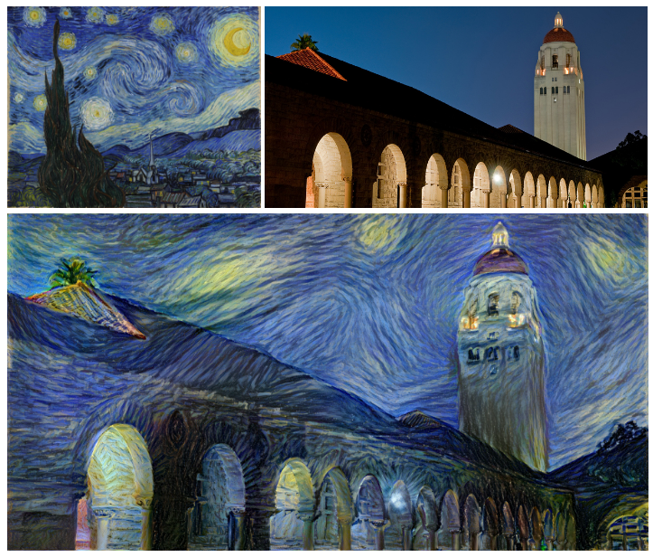

上面这张图选自 https://github.com/jcjohnson/neural-style 的Torch实现。

## Representation of content

要利用梯度下降法从白噪声中寻找一张符合条件的图片，我们必须先定义这个条件。我们希望这张图片满足：内容要尽量接近原图，但是风格要尽量接近另一张图。

先说内容是怎么定义的。比如说图片中有一棵树，那么这棵树就算有一点变形或者有一点移位，我们人类依然会认为图片的内容没有变。也就是说人的视觉系统对树的这点变化并不敏感。那么请问，人的视觉系统都对什么东西敏感呢？可以这么看：人的视觉系统最常做的工作就是辨识物体，所以人的视觉系统，肯定是对日常生活中所需要用到的各种不同物体的外观以及它们之间的差别敏感的。也就是说，这个敏感度源自每个人生活的环境、接触的事物。于是他们就以“VGG19”神经网络的中间层输出，作为“感官视觉误差”的估计方法。VGG19网络可是拿过ImageNet冠军的，它对不同种类物体的区分能力接近人类，因此用它作为感官误差的评价函数是很合适的。

网上有各种展示卷积神经网络内部工作原理的图，这里我就简单画一下。每一张activation map对应的是一类feature，越高层的activation map对应的feature抽象层次越高。

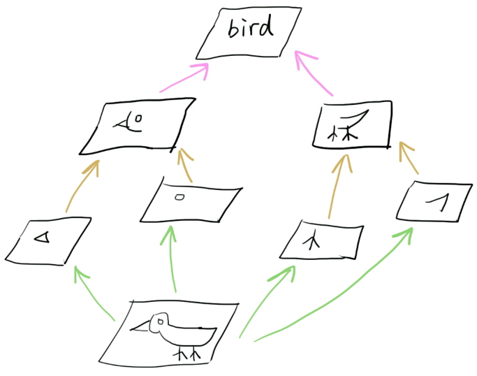

因此，如果将一张图片（比如上面这个鸟的图片），输入一个经过训练用于物体分类的神经网络，取得其中一层的activation，再以此activation为目标，对一张白噪声输入图像进行梯度下降，就可以得到内容接近于原图的一张新图片。这张新图片能够在神经网络的某一层，产生与原图类似的activation分布。

比如说google的Deepdream就是干这个事：

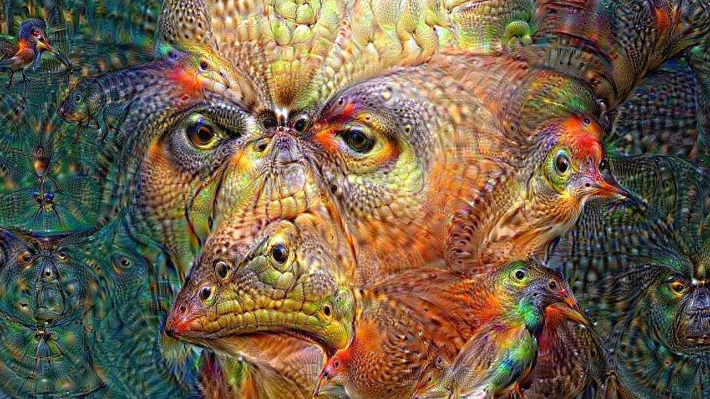

（其实多半被用来干这种事：

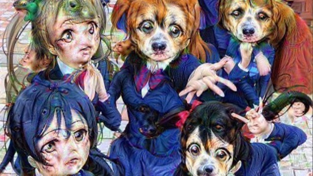

如果你已经学习过卷积神经网络，这应该并不难理解。

## Representation of style

然后说风格是怎么定义的。风格可以认为是画家的一种习惯：比如物体的光影如何表现，色调的搭配，花草树木用什么笔触勾勒……等等。以上这些描述都不是数学的，没有办法用于我们的优化过程。researcher们发现，可以对神经网络中间层的activation map求其Gram矩阵，并用该矩阵表示风格。换句话说，两张图片在神经网络某一层的Gram矩阵的均方差(MSE)越接近，这两张图片的风格也越接近。然而，这是什么意思？

先看简单的例子。之前我们谈到，神经网络每一层的输出，也即每一张activation map都对应着一类feature的分布。下面这张图演示的就是这个关系。这里有两张图片，其中一张树和花是分开的，另一张树和花是重叠在一起的：


在右边的输入图像中，花和树被画在了一起。经过卷积神经网络的层层卷积，在某一层的输出我们得到两张feature map，分别代表花和树在图像空间中的分布。假如这就是画家的风格（喜欢把花和树画在一起），我们要怎么表示这种风格呢？

首先我们把右边神经网络activation map中所有的像素展开成一列，然后每个feature一列排成一个矩阵，变成下面的形式：


矩阵的行代表不同的feature（比如花和树），列代表activation map中的每一个像素。

上面这个矩阵，在原论文中被称为F矩阵。这个矩阵隐藏了画家的习惯：比如上面这个图，我们就可以说这个画家的作品中，花和树倾向于同时出现。除此之外，笔触习惯，色彩搭配……这些都可以在F矩阵中找到。
但是仅求到F矩阵是不够的。F矩阵还包含了位置信息，比如画家具体在什么位置画了一朵花、一棵树。而我们知道，风格和绝对位置是无关的，一个画家的某种风格可能出现在画面的任意位置。因此不能通过直接比较F矩阵来比较两张图片的风格。

我们需要知道的，是各种特征之间的**相对**关系，也就是花的旁边出现树的可能性、树的旁边出现花的可能性。所以我们要对F矩阵做一个统计。统计的方法很简单：

>前方有线性代数内容，请注意防范。

```py
def Gram(F):
    return np.dot(F.T, F) / F.size
```

即F矩阵的转置，与F矩阵相乘。这又称作F的内积。因为统计的关系，结果要除以F矩阵的元素数目。于是我们得到一个Gram矩阵，它长这样：


如上图，这个矩阵里的每一项，表示其行和列所对应的两个特征，在同一个位置被检测到的相对几率。因此重叠的行和列（对角线上的花-花、树-树）值会比较大。

从gram矩阵中我们可以很清楚的看到，相比于其他特征，这个画家似乎比较喜欢把花和树画在一起。如果是更低层的神经网络，求得的gram矩阵就可以指出这个画家似乎比较喜欢把红色和绿色的笔划配在一起。因此如果两张图片具有一样的作画习惯，那么它们在神经网络某一层的Gram矩阵数值上就会比较接近。这就是为什么我们要用Gram矩阵来定义一张图片的风格。

我们还发现，不管输入图像的尺寸有多大，由每一层神经网络的activation所计算出的gram矩阵，尺寸都是一样的（行、列长度均为该层神经网络的feature map数量）。这也就是为什么style transfer对输入图像的尺寸没有严格要求。

## That's all?

整个系统如下图。


将风格图像、内容图像和目标图像都输进VGG网络，然后计算内容误差(content loss)和风格误差(style loss)，将它们分别乘以系数alpha和beta并相加，得到总误差，然后求目标图像对误差函数的梯度，最后利用该梯度对目标图像做梯度下降，这就是一个循环。

重复N次这个循环，最终目标图像就能获得我们期望的结果，整个所谓的style transfer其实就是这么回事。最近国内有个95后创业，专门开了个2499人民币的班，教大家用tensorflow做style transfer，把我感动的够呛。

目前为止一切听起来都很美好，实际上当然不是的。看下面这个情况：

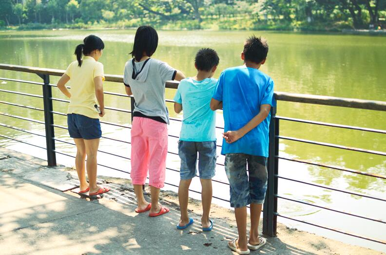

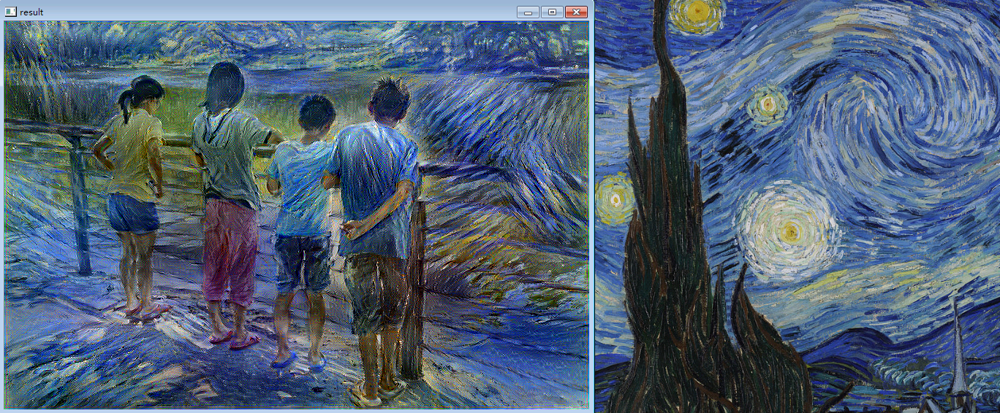

有点……噪声？噪声是初始化的问题，我把初始方差设大了，而VGG对输入噪声免疫，因此噪声降不下去。

关键不在这里。我们看看整个梯度下降的过程：

开始

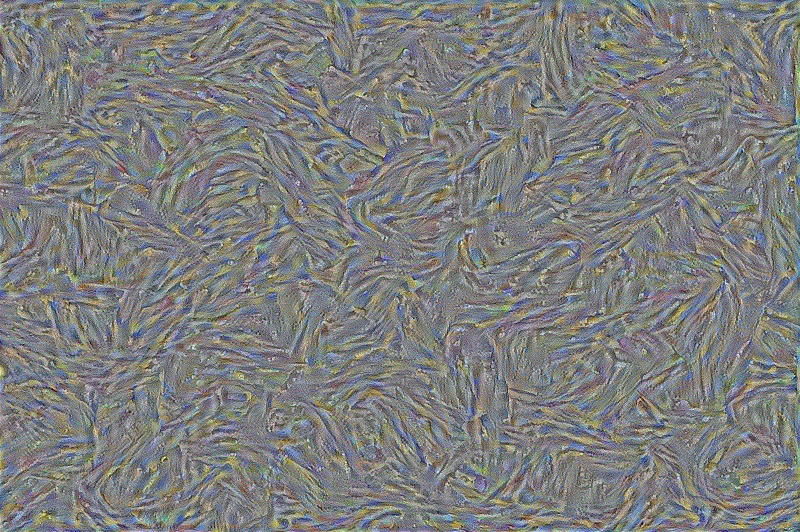

210 epoch

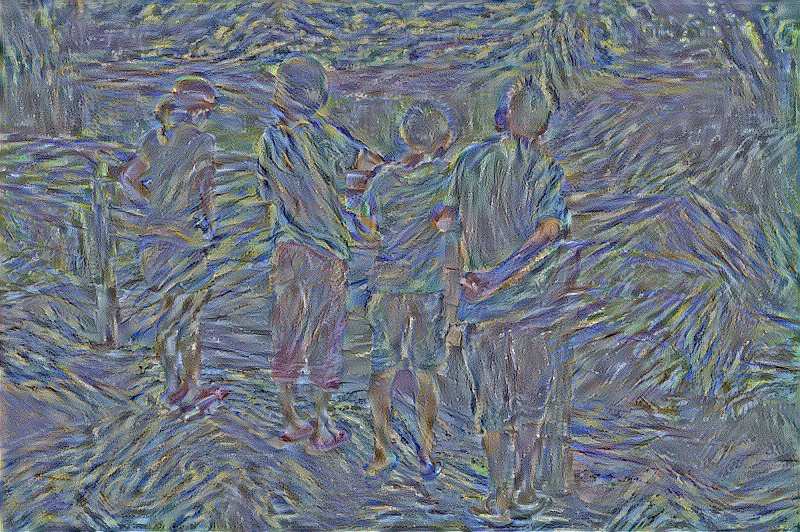

~ 1000 epoch

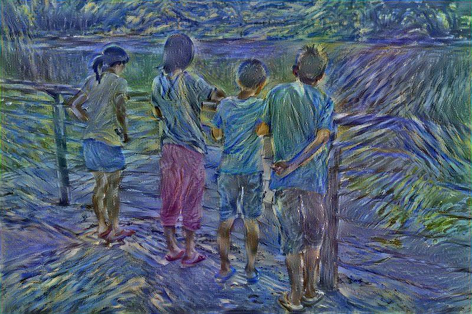

~ 24000 epoch

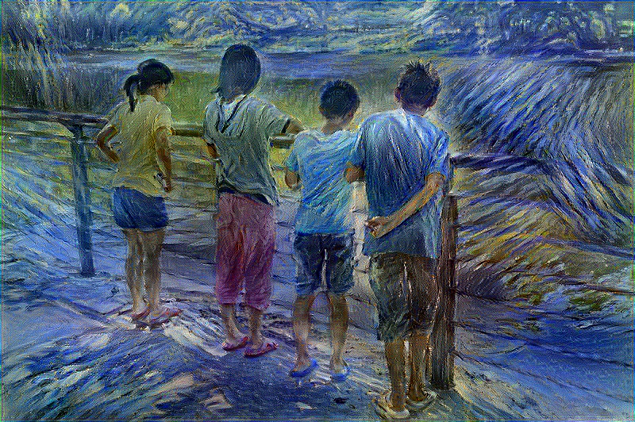

怎么差这么远？本来是偏向风格的，后来怎么又偏向内容了？这和优化地形有关系。我们设置的误差函数包含内容误差和风格误差，但是优化器在优化的时候，只是让这两个误差的和下降，但并不保证这两个误差各自都以同样的速度下降。所以大部分时间一个误差总是会比另一个下降得更快一些。不过按照道理来说，经过足够长的时间，总该两个误差都降下来吧？

根据style transfer论文，似乎确实是这样，不过他们在论文里可没提他们用了什么优化器，只说了梯度下降。其实这里才是头痛的地方。来看下面这个例子：

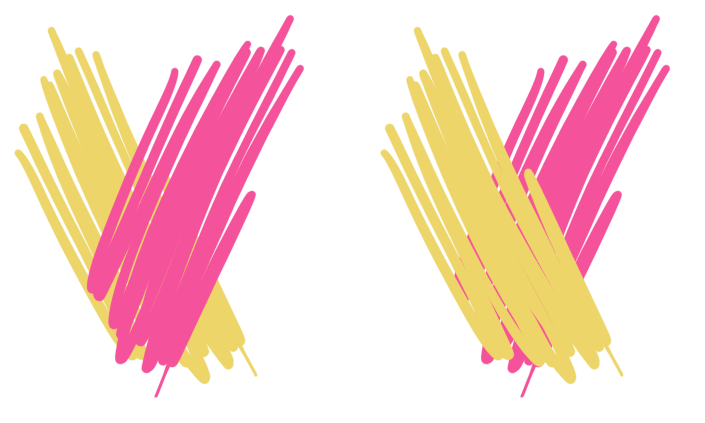

上面是同一个画家的同一种style的两种表达，这两种表达的style loss都很低。假如现在图像已经是左边那种情况，而右边那种情况的content loss更低，那如果图像要从左边那种情况逐渐变到右边那种情况，中间必然会经历一个style loss 比较高的过程：

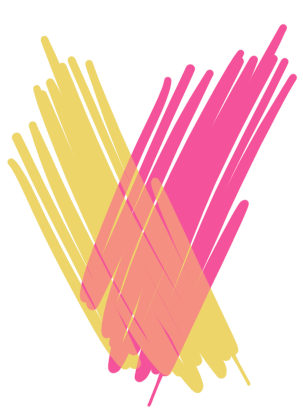

换言之，我们将要优化的误差函数，多半长这样：

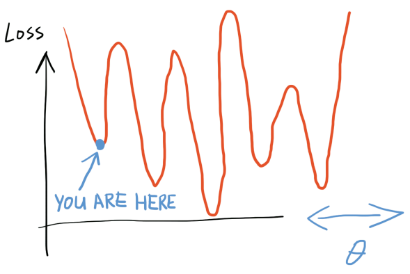

（当然我们要优化的变量有几M个，这里用一维只是演示）

学习率太高，落不到谷底；学习率太低，走不出局部最小值。而且因为解的稀疏性，不管学习率开多高，用多大的momentum，都不可能找到全局最优解（这就是为什么style transfer算法不同的初始条件生成的图像会有较大区别）。

整个梯度下降过程最开始运行的时候，style loss远高于content loss，因此算法会先优化style(满屏幕都是笔画，看不到具体内容)。
原本设定好的内容和风格的比例，最后要很久才能达到。
这可能就是我最开始设错参数的原因（我把内容误差的权重alpha调得太大了，最后图片原本的色彩盖过了我希望施加的风格（人物衣服颜色都保留着）;用于评判内容误差的网络层选得太低(conv4_2)，导致生成图像中的内容太接近物体原本外观，而不够艺术化）

经过一整天的尝试，得到结论如下：

1. 纯粹梯度下降，只会得到满屏幕的笔触（最开始的时候算法只顾着style loss，然后就陷入style minima，无法进一步降低content loss）
2. 使用momentum，需要一路调learning rate，初始learning rate不高就跑不动，太高就diverge；不一路降低learning rate则不收敛，降快了就收敛到局部最优。
3. 使用Adam和RMSProp之类的优化器，learning rate开高了会一段时间后开始震荡diverge，因为误差总是不降于是它们就抓狂了想跳出局部最小值。diverge的效果就是从看图片变成看动画片。learning rate开低了则要等很久很久才能收敛。总之生命不息，调参不止。

这也就解释了，为什么各种style transfer实现，都优先选用L-BFGS为优化器。L-BFGS属于 second order method，对上述诸多问题免疫力较高，只可惜L-BFGS原作太高深，以Fortran书写，各大学习框架尚不敢妄自实现，连scikit也只是拿人家的Fortran wrap了一下，而tensorflow又把scikit wrap了一下，到目前为止还没人把这算法弄上显卡。

## Finally

因为VGG19比较慢，我实验都用的是VGG16.

1. 把 content layer 从 conv4_2 调到 conv5_2. 为了验证content layer 捕捉到我需要的内容，先将style loss关掉，然后以Adam学习率0.001对输入进行梯度下降，效果如下

    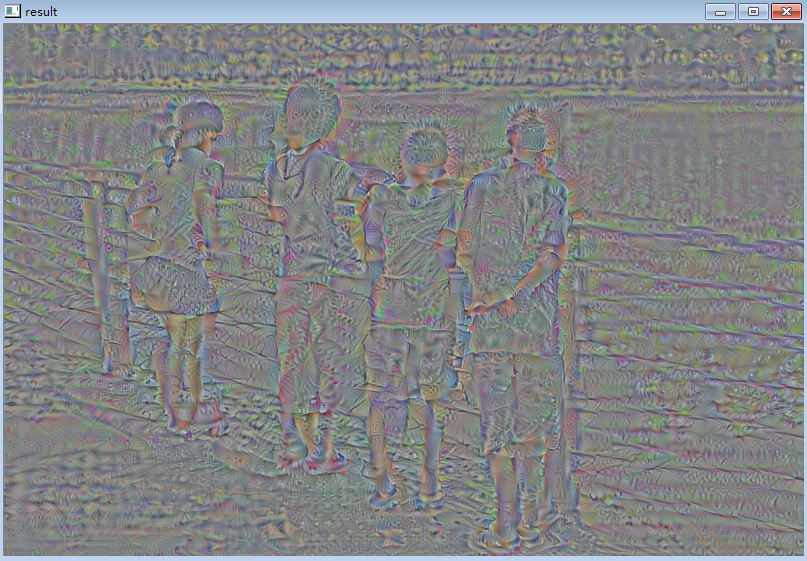

2. 把content loss 的比例，即alpha/beta，从 0.02调到0.001（原style transfer论文数值）。事后发现这个比例会不会又太低了一点

3. 把输入白噪声图像的标准差调到0（准确的说是1e-22），也就是没有噪声的图像，然后开始梯度下降。

    ```py
    # create white_noise_image
    global white_noise_image
    white_noise_image = tf.Variable(
        tf.random_normal([1]+output_size+[3], stddev=1e-22),
        dtype=tf.float32,name='white_noise_image')
    ```

    把噪声调到0是很有意思的，相当于初始的梯度方向就不包含随机分量，而完全是由网络架构决定的了。

    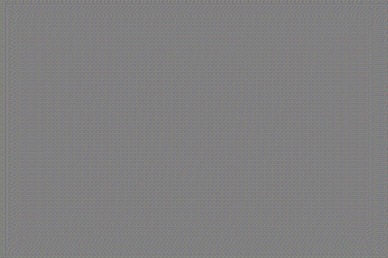

    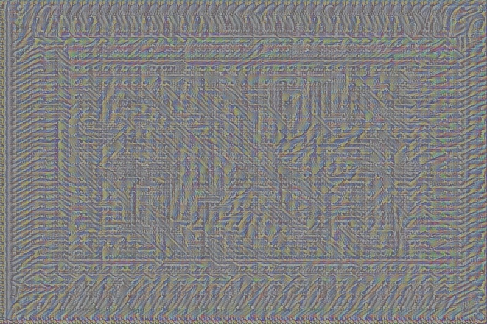

    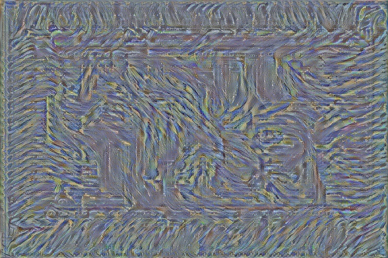

4. 效果很差，重来，学习率提高到0.1

    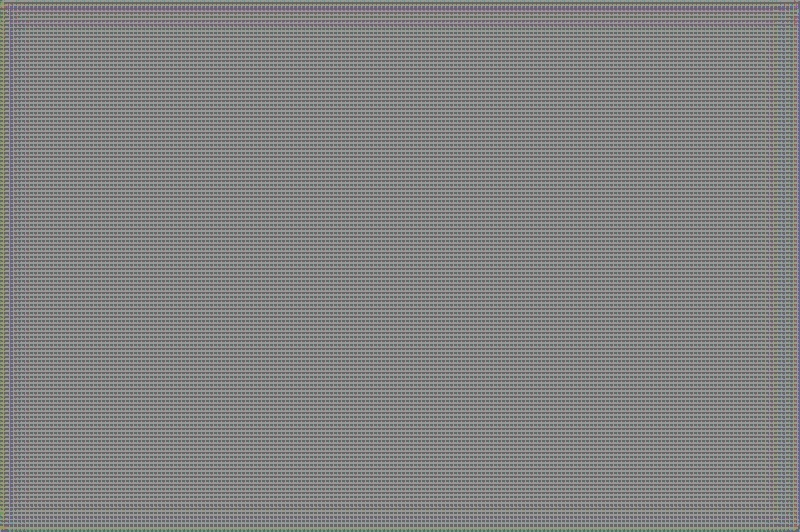
    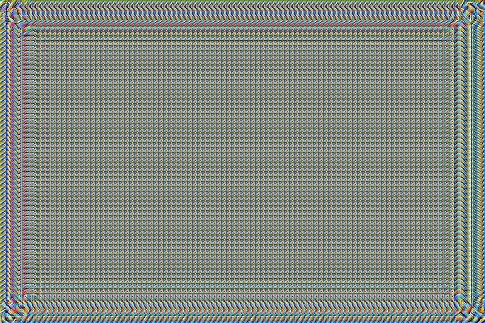
    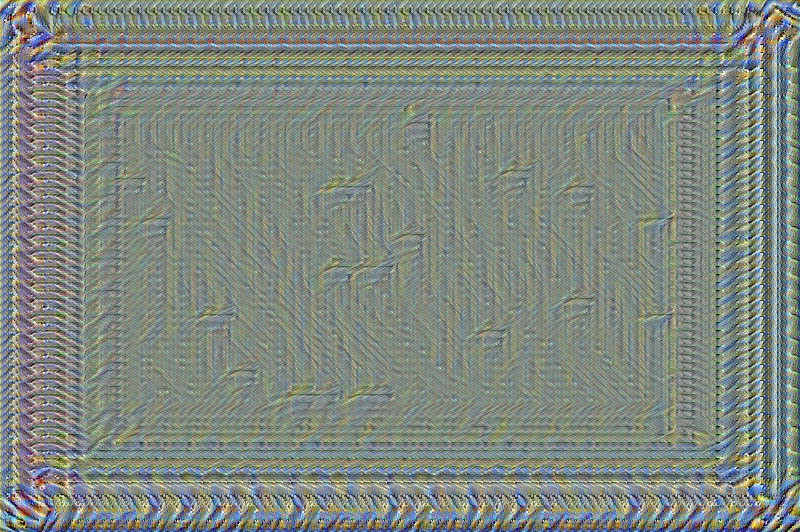
    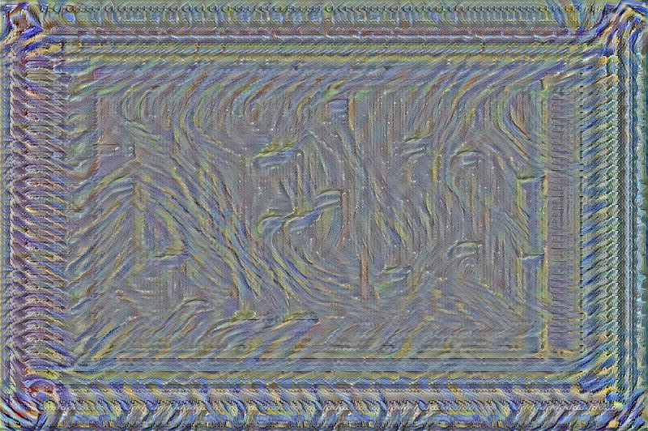
    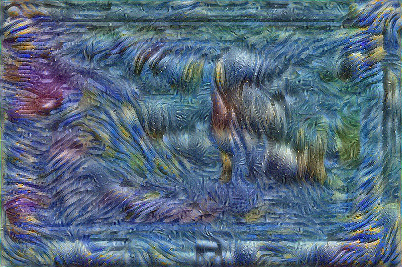
    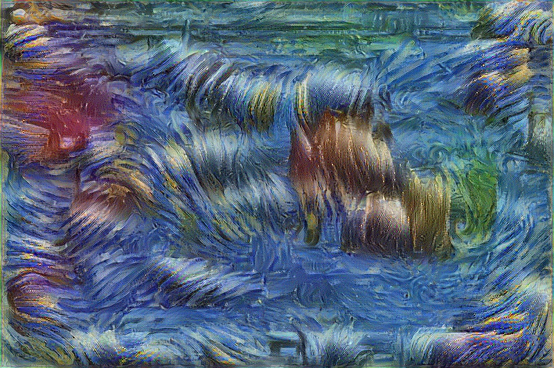

    你看我说吧，Adam震荡了

    震荡并不是坏事：经过几次震荡，感觉图像中的笔触纹理都连续了很多，这显然是比原来的一团乱麻更优的解。但持续震荡的一大缺点就是它无法在有限时间内落到一个大家相对满意的局部最优解里，就像煮开水如果一直加热就可以一直杀菌但一直不能饮用

5. 为什么content总是出不来，干脆直接把白噪声图像换成content原图，这样content loss就直接拉到0，然后等style loss慢慢下降。学习率压到0.01，然后去床上躺一会儿

    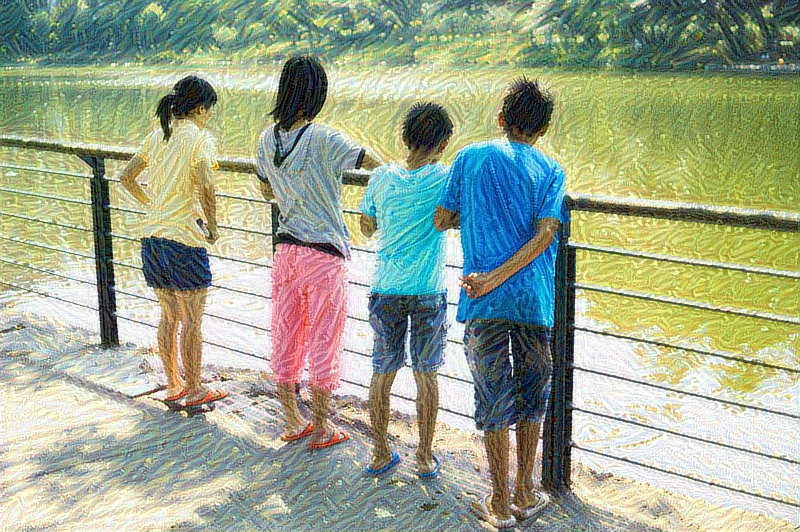
    
    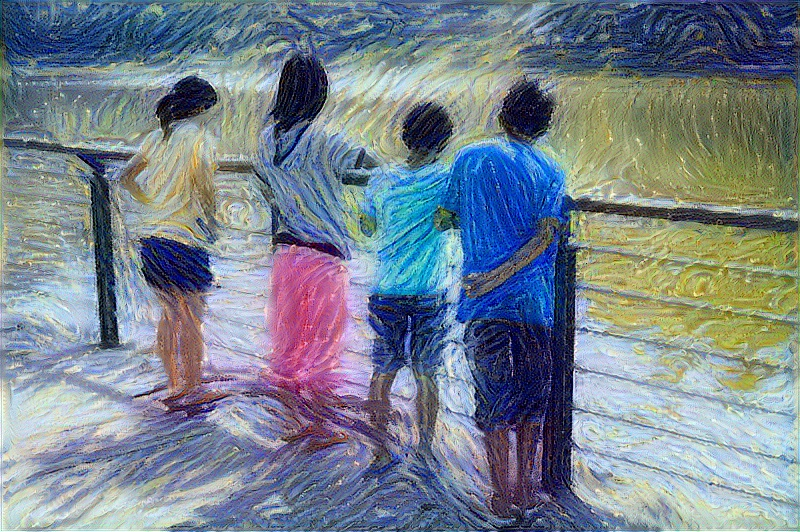
    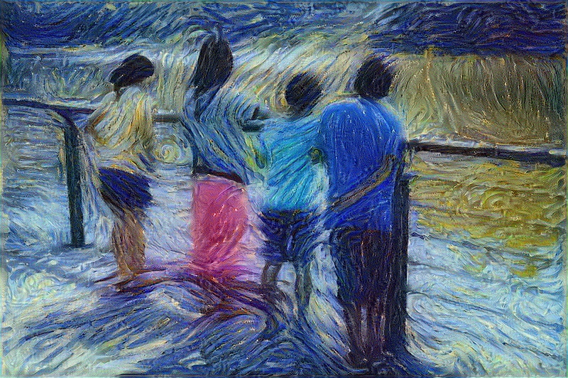

    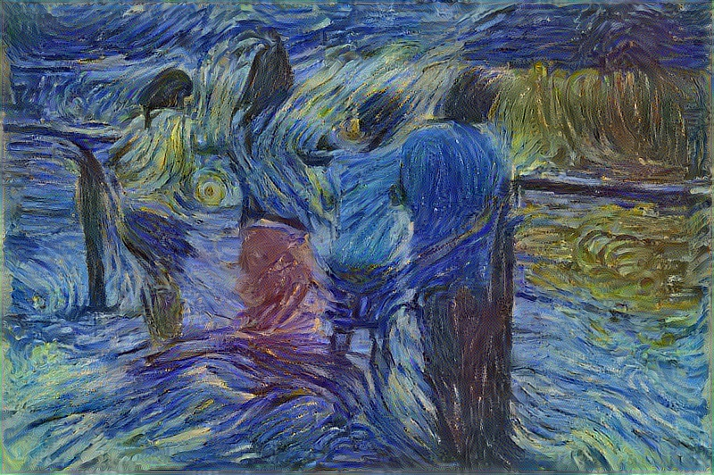

    终于好了，跟原画并排比一下就知道了：

    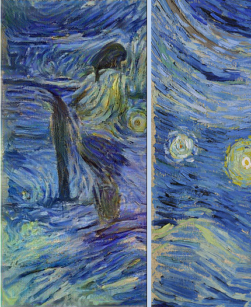

    整整跑了 10000 epoch

    你可能会发现经过transfer的style和梵高的画仍然有差距。描述的精确程度主要取决于Gram矩阵的大小，比如神经网络的某一层有256个filter，那么Gram矩阵就是256x256.这个矩阵越大，包含的风格信息越多，对细节的刻画自然就越精细。上面的结果我只从VGG16网络中的5层（跟原论文一样）采样Gram矩阵，增加采样层数会拖慢速度。

    换句话说就是VGG网络虽然很牛逼，但是也不可能捕捉所有细节啊，你非要那么仔细去比较两张图，考虑过神经网络的感受吗？

6. 增加Gram矩阵采样到所有卷积层（最大限度地保存style）。同时将content loss的比例alpha稍微调高一点，感觉上面图中的人都有点分辨不出了。

    做好我会把图传上来的。
