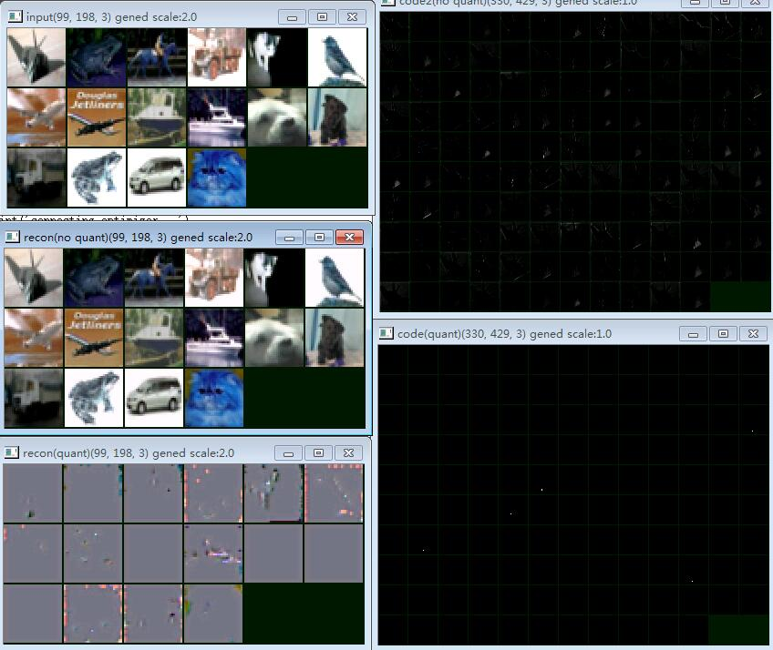

!NPEG图像压缩

# NPEG图像压缩 - Neural Network Image Compression

> This page is written in Chinese. English readers might prefer to go directly to the repository: <https://github.com/ctmakro/npeg>

> 阅读本文需要基本的卷积神经网络知识。

对二进制串进行编码，空间最优的方法是霍夫曼法。不同二进制串的熵不同，使用霍夫曼法进行编码后的长度也不同，即压缩比不同。

下面是两串二进制：

100001001000000000 - 10010110101101010001

对霍夫曼法而言，第一串比第二串要更容易压缩，压缩后的长度更短。

对媒体数据进行有损压缩，分两步：

1. 将媒体数据通过一定方法，转换成0或者1比较多的某种二进制表示形式
2. 对结果进行霍夫曼编码，实现压缩。

JPEG是这么做的：

0. 把图像分割成若干8x8小块
1. 把8x8的二维图像转换成64x1的一维图像
2. 对64x1图像作DFT，得到不同频率下的幅度和相位
3. 剔除DFT结果中幅度较小的项（假设人眼对这些项不敏感），使得结果中0变多，能够被霍夫曼法压缩得更小
4. 对结果进行霍夫曼编码，实现压缩。

JPEG这个方法有很多缺点。DFT剔除项之后，边缘处像素的值会发生变化，造成图像的不连续。经JPEG压缩的图像，最显著的特点就是图像中能看到大量8x8的马赛克方块。

能不能别把图像切成一块一块分别转换成二进制串，而是连续地将整张图像转换成一张大的bitmap呢？嗯，可以用卷积神经网络(CNN)试试。

要把图像转换成二进制串再转换回来，需要两个CNN，一个负责编码（图像->0-1 bitmap），一个负责解码（0-1 bitmap->图像）。

训练架构（绿色箭头表示以降低误差为目标，更新参数）：

<dot
digraph{
  "image(3通道)" -> "Encoder CNN(3->128通道)" -> "sigmoid" -> "Decoder CNN(128->3通道)" -> "MSE(均方差)"
  "image(3通道)" -> "MSE(均方差)" -> loss
  loss->"Encoder CNN(3->128通道)"[color=green,constraint=false]
  loss->"Decoder CNN(128->3通道)"[color=green,constraint=false]
}
/>

其中sigmoid函数的作用是把encoder的输出限制到0和1之间。为了让网络多输出0，少输出1（以便压缩），我在生成的二进制码上添加了一个惩罚项：

```python
loss = tf.reduce_mean((y-x)**2) + tf.reduce_mean(binary_code**2) * 0.01
```

这样架构就变成了：

<dot
digraph{
  image -> "Encoder CNN" -> "sigmoid" -> "Decoder CNN" -> "MSE(均方差)"
  image -> "MSE(均方差)" -> loss
  loss->"Encoder CNN"[color=green,constraint=false]
  loss->"Decoder CNN"[color=green,constraint=false]
  "sigmoid" -> "N^2" -> loss
}
/>

训练开始之后，情况是这样的：



左边从上到下：

- 输入图像（共3通道）
- 从sigmoid输出解码的图像
- 将sigmoid输出二值化，然后解码的图像

右边从上到下：

- sigmoid输出 （由左边第一张图生成，共128通道）
- sigmoid输出，二值化之后

仔细看可以看到，sigmoid输出并不是用0和1，而是在用深浅不同的灰色表示信息，而decoder也是从这些深浅不同的灰色中还原图像的。如果我们把sigmoid输出二值化，这些信息就完全丢失了。那么，要怎样才能逼神经网络用0和1，而不是0和1之间的其他数值来表示信息呢？

答案是增加噪声！

如果我们在sigmoid函数之前添加高斯噪声，那么encoder和decoder就会开始发现，用灰色不可靠，只有用0和1编码的信息才能抵御噪声干扰。

增加高斯噪声之后，架构变成了这样：

<dot
digraph{
  gaussian -> sum[color=brown,constraint=false]
  image -> "Encoder CNN" -> sum -> "sigmoid" -> "Decoder CNN" -> "MSE(均方差)"
  image -> "MSE(均方差)" -> loss
  "sigmoid" -> "N^2" -> loss

  { rank=same; gaussian sum }

  loss->"Decoder CNN"[color=green,constraint=false]
  loss->"Encoder CNN"[color=green,constraint=false]
}
/>

将噪声的标准差调到15，训练效果如下：


可以看到，网络已经学会用二进制dither来编码图像内容，对sigmoid输出做不做二值化区别不大。

运行本文实验的代码在我的github上：<https://github.com/ctmakro/npeg>
