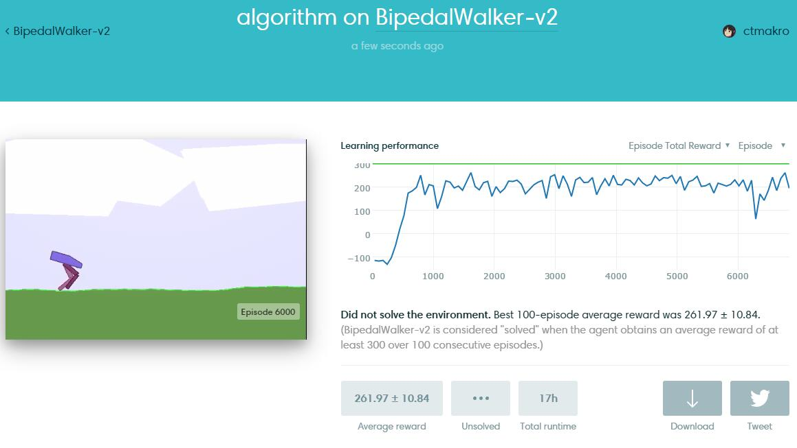
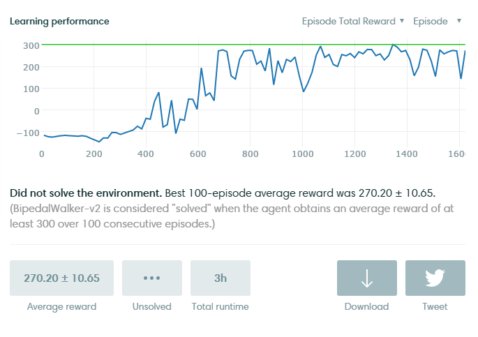
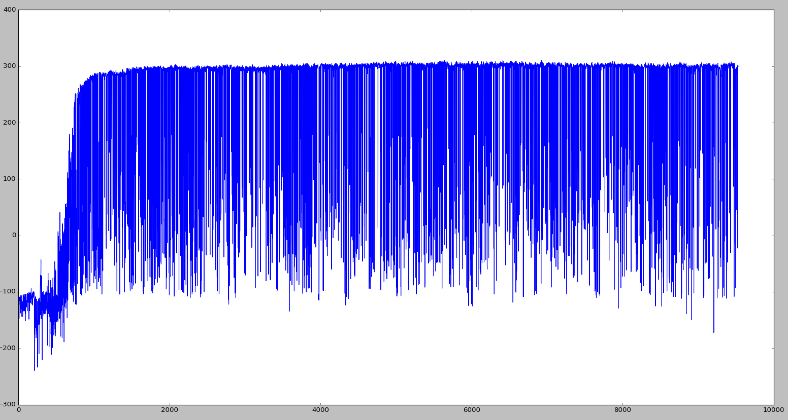
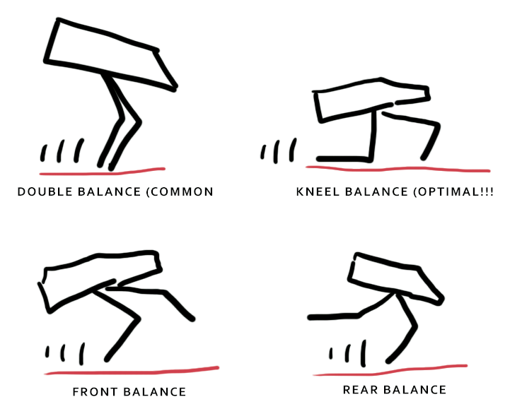

!BipedalWalker-v2

# BipedalWalker-v2

<video controls loop autoplay src="https://openai-kubernetes-prod-scoreboard.s3.amazonaws.com/v1/evaluations/eval_yZqDtftNTmO8xIEoLwciQ/training_episode_batch_video.mp4"></video>

Reinforcement Learning in the real world is still an ill defined problem. The agent have to be greedy; But not too greedy. One might conjecture that an optimal agent should have bayesian behaviour, which again is not always what we want, nor the design goal of our brain. We want the agent to be curious so they could exploit the environment whenever possible, but not too curious so that they will continue to work for us.

It's like training your employee. You want your employee to be exceptionally efficient at his job; while at the same time you want them to stay working for you. Which is hard, if not impossible. (unless you're Google...)

## The Impossible

<https://gym.openai.com/evaluations/eval_yZqDtftNTmO8xIEoLwciQ>

BipedalWalker-v2 is a very hard environment on Gym. Your agent should run very fast, should not trip himself off, should use as little energy as possible. 即又要马儿跑，又要马儿不吃草

>This is not a tutorial. Go learn what is Gym and Reinforcement Learning. Some resources are listed in this blog.

"Solving" the environment require an average total reward of over 300 over 100 consecutive episodes. Which is NOTORIOUSLY HARD. (less than 5 people solved it on Gym) My DDPG agent (yes, the name of the algorithm) can get up to 305 for a few episodes, then the peformance drops for a while (agent start making stupid mistakes and fall), then rise up to 300, again and again. Which of course is unstable, and if you smooth the peformance curve you get the curve shown above (around 250).

>above from another run.

From the curve you will also notice: It's not that hard to learn to walk. Since DDPG is deterministic, for exploration I added 1/fsquare noise to the output and decrease it overtime. The agent will learn the basics of walking at around 700 episode, when the noise is down low enough to stabilize the actions.

Then I added some plotting code:

This is not what I want.

## The curse of online learning

Start by logging the training error. The training is not very stable. The critic seem to have a hard time fitting a few bad datapoints, and when those datapoints (from the replay memory) are being trained on, the critic loss (predicted vs projected Q-value) rises. And as soon as the critic loss rises, the actor loss rises, then we start to see agents falling.

Why not just use Cross Entropy Method? Because for this problem, the number of parameter is too large for any unbiased offline method. It would take way too many episodes to converge.

## The Cure

- try lower learning rate

  the replay memory is growing. At first when there are only 100k pairs or so, Adam optimizer at its default setting can do a pretty descent job; But after reaching 1M pairs I think I should decrease the learning rate to reduce the variance of the gradients.

- slightly deeper/wider network

  did help.

- reduce deviation from proven good policies (eg. trust region policy optimiztion)

## Appendix

There are 4 major stragegy to walk, your agent is using one of them.

