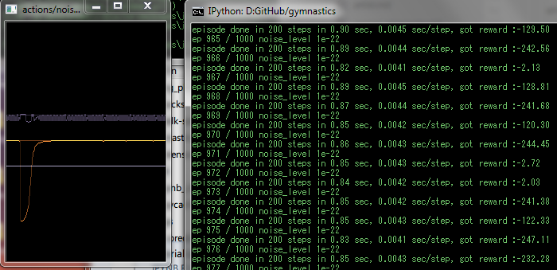

!DDPG Method

# Deep Deterministic Policy Gradient Method

Paper's here: <https://arxiv.org/pdf/1509.02971.pdf>

Basically you have two network, one called the `actor`, another `critic`.

- The actor take state as input and outputs actions
- The critic take state-action pairs as input and outputs the Q value

In DDPG the actor perform a deterministic policy (given input, the output is not a probabilistic distribution, but a value). We let the critic to judge how good did the actor do; then the actor can use this information to improve its policy. The problem then become: how can we train such a network in Keras?

> Of course you can't. For my own convenience I wrote a small library called `canton`. Check <https://github.com/ctmakro/canton> for more details.

1. Define the inputs: (state, action, reward, done?, next-state)

    ```py
    s1 = tf.placeholder(tf.float32,shape=[None,self.inputdims])
    a1 = tf.placeholder(tf.float32,shape=[None,self.outputdims])
    r1 = tf.placeholder(tf.float32,shape=[None,1])
    isdone = tf.placeholder(tf.float32,shape=[None,1])
    s2 = tf.placeholder(tf.float32,shape=[None,self.inputdims])
    ```

2. Train the critic by minimizing the MSE loss between predicted Q and calculated Q (using Temporal-Difference):

    ```py
    a2 = self.actor_target(s2)
    q2 = self.critic_target([s2,a2])
    q1_target = r1 + (1-isdone) * self.discount_factor * q2
    q1_predict = self.critic([s1,a1])
    critic_loss = tf.reduce_mean((q1_target - q1_predict)**2)
    ```

3. Train the actor by maximizing the expected reward:

    ```py
    a1_predict = self.actor(s1)
    q1_predict = self.critic([s1,a1_predict])
    actor_loss = tf.reduce_mean(- q1_predict)
    ```

4. You may have noticed that there are two network called "actor_target" and "critic_target". They are copies of actor and critc, with their weights slowly gradually updated from actor and critic (to reduce action-sample correlation thus stabilize learning).

    ```py
    tau = tf.Variable(0.001)
    aw = self.actor.get_weights()
    atw = self.actor_target.get_weights()
    cw = self.critic.get_weights()
    ctw = self.critic_target.get_weights()

    shift1 = [tf.assign(atw[i], aw[i]*tau + atw[i]*(1-tau))
        for i,_ in enumerate(aw)]
    shift2 = [tf.assign(ctw[i], cw[i]*tau + ctw[i]*(1-tau))
        for i,_ in enumerate(cw)]
    ```

4. That's it. By using the `canton` library, instead of creating multiple versions of networks in Keras or dealing with variable scopes in TensorFlow, you can now update everything in one `tf.Session.run()`:

    ```py
    opt = tf.train.RMSPropOptimizer(1e-4)
        cstep = opt.minimize(critic_loss,
            var_list=self.critic.get_weights())
        astep = opt.minimize(actor_loss,
            var_list=self.actor.get_weights())

    def feed(memory):
        [s1d,a1d,r1d,isdoned,s2d] = memory # d suffix means data
        sess = ct.get_session()
        res = sess.run([critic_loss,actor_loss,
            cstep,astep,shift1,shift2],
            feed_dict={
            s1:s1d,a1:a1d,r1:r1d,isdone:isdoned,s2:s2d,tau:1e-3
            })
    ```

Code available at <https://github.com/ctmakro/gymnastics/blob/master/ddpg.py>.

At the time of this writing:

- I added some 1/f noise to the output at the beginning of learning, change if you want
- There's an oscilloscope-like window (hand-drawn in `numpy`, display with `cv2`) showing the current action value and Q-value, remove if not needed

    

- I won the 2nd and 3rd place on `Pendulum-V0` (the 2nd and 3rd place submission are actually based on an older implementation of DDPG using Keras, which is extremely verbose thus not recommended reading)

    
